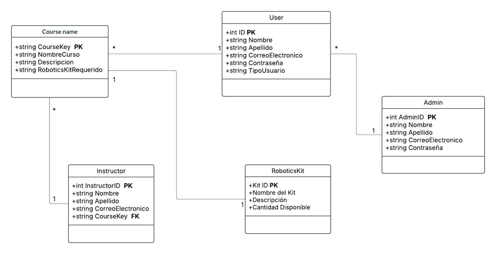

# Proyecto de Sistema Educativo de Robótica

## Descripción del Proyecto

Este proyecto consiste en un backend desarrollado con FastAPI y SQLAlchemy para gestionar un sistema educativo de cursos de robótica. El sistema está diseñado para interactuar con una base de datos MySQL y proporciona una API RESTful para la gestión de cursos, usuarios, instructores, administradores y kits de robótica.

### Componentes principales:
- **Base de datos**: Configurada en MySQL a través de XAMPP, con la conexión establecida mediante SQLAlchemy.
- **Modelos de datos**: Define las entidades principales del sistema como Course, User, Admin, Instructor y RoboticsKit.
- **Esquemas Pydantic**: Proporciona validación de datos y serialización/deserialización para las operaciones de API.
- **API FastAPI**: Expone endpoints para interactuar con los datos del sistema.

### Estructura del proyecto:
- `app/models.py`: Define los modelos de SQLAlchemy para las tablas de la base de datos.
- `app/schemas.py`: Contiene los esquemas Pydantic para validación de datos.
- `app/main.py`: Punto de entrada de la aplicación FastAPI.
- `database/database.py`: Configuración de la conexión a la base de datos.

## Diagrama Entidad-Relación



El diagrama muestra las siguientes relaciones:

- Un **Course** puede requerir un **RoboticsKit** específico (relación muchos a uno)
- Un **Instructor** está asignado a un **Course** (relación muchos a uno)
- Los **Users** representan a los usuarios generales del sistema
- Los **Admins** tienen privilegios especiales para gestionar el sistema

Las entidades principales incluyen información como datos personales, credenciales de acceso, y detalles específicos según el tipo de entidad (descripción de cursos, disponibilidad de kits, etc.).

## Requisitos

- Python 3.8+
- FastAPI
- SQLAlchemy
- MySQL
- XAMPP (para gestionar MySQL)

## Instalación

```bash
# Clonar el repositorio
git clone https://github.com/tu-usuario/sistema-educativo-robotica.git
cd sistema-educativo-robotica

# Crear entorno virtual
python -m venv venv
source venv/bin/activate  # En Windows: venv\Scripts\activate

# Instalar dependencias
pip install -r requirements.txt

# Configurar la base de datos
# Asegúrate de tener XAMPP ejecutando MySQL
```

## Uso

```bash
# Iniciar el servidor
uvicorn app.main:app --reload
```

Visita `http://localhost:8000/docs` para acceder a la documentación interactiva de la API.

## Endpoints principales

- `/courses/`: Gestión de cursos
- `/users/`: Gestión de usuarios
- `/instructors/`: Gestión de instructores
- `/admins/`: Gestión de administradores
- `/robotics-kits/`: Gestión de kits de robótica

## Licencia

[MIT](https://choosealicense.com/licenses/mit/)